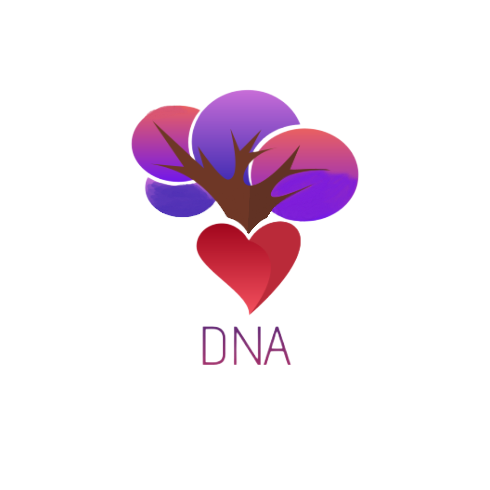

 
 
 

 

  <h1>✍ Description </h1>
  Vis!00 is a newly formed team made up from 4 team members. The goal of the team is to create a game a biology based game for educational purposes.You can download our grame from our release tab!
  <h1>🤝 Our Team </h1>
  

  
1. **Lubomir Georgiev** - **Scrum trainer**	
   > ***GitHub profile***: [***LRGeorgiev***](https://github.com/LRGeorgiev)	

2. **Krasimira Ruseva** - **Backend Developer** 
   > ***GitHub profile***: [***krasimiraruseva1***](https://github.com/krasimiraruseva1)	

3. **Toni Chodzhorova** - **Backend Developer** 
   > ***GitHub profile***: [***tonichodzhorova***](https://github.com/tonichodzhorova)	

4. **Lorena Hristova** - **Designer** 
   > ***GitHub profile***: [***LSHristova20***](https://github.com/LSHristova20)
   
  

  
  <h1>🚀 Used technologies</h1>
  
 
	 
	
	
	
	
	
	
	

  

	
   
   <h1>📝 Documents</h1>
  

 <h2> <a href ="" >📄 Documentation</h2>
 <h2> <a href ="" >🖥 Presentation</h2>

	
	
## ***If you like our project you can 🌟 us!***
